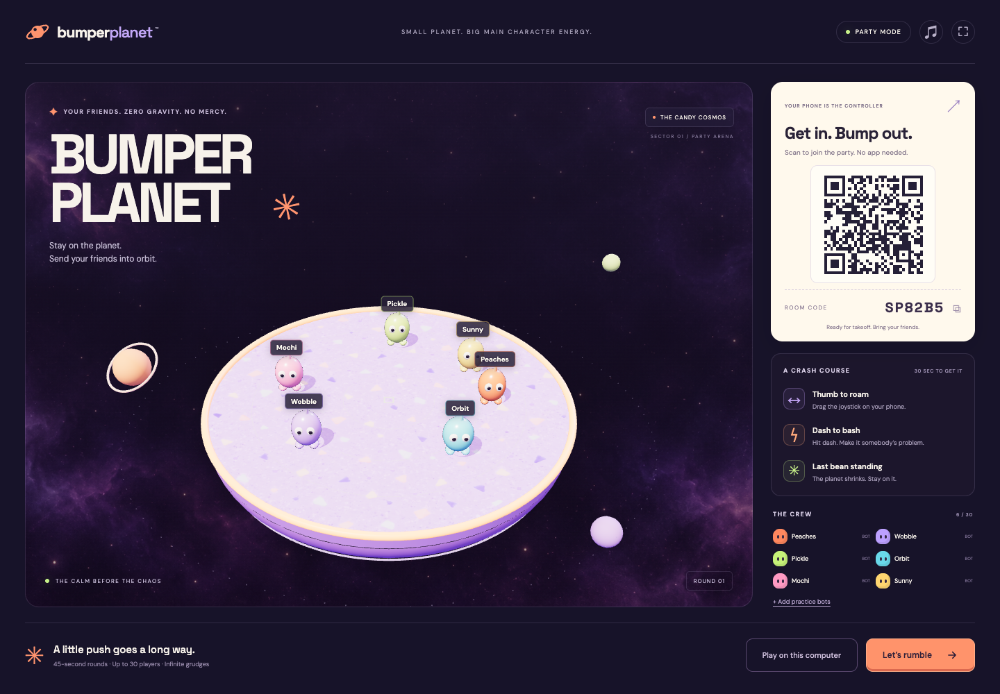
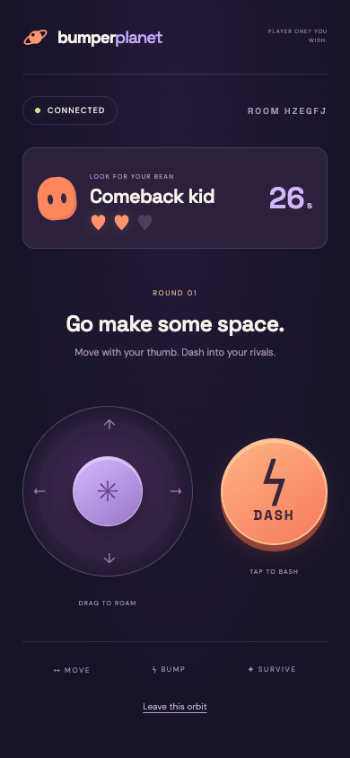

# Bumper Planet

A shared-screen 3D party game. Scan a room QR code, pick a jelly bean, and use your phone to bump everyone else off a shrinking candy planet.

**[Play Bumper Planet](https://bumper-planet.vercel.app)** — open it on the big screen, then scan the QR code with your phone.

## Screenshots





## Run locally

```sh
npm install
npm run dev
```

Open http://localhost:5173 on the projector computer. The QR code uses the computer's LAN address so phones on the same Wi-Fi can join. The host must keep the game tab open and visible. Some event Wi-Fi networks block device-to-device traffic; use a shared hotspot or the deployed HTTPS version in that case.

Click **Let’s rumble** to start. Rounds last at most 45 seconds, with a three-second countdown and ten-second automatic rematch. Six bots are included for immediate play. Use **Remove practice bots** under The Crew to clear them; they stay removed until you add them again. At least two connected players are needed to start a round. **Play on this computer** adds a keyboard player (WASD/arrows, space to dash). Phones joining during a round enter the next round.

Each player starts every round with three lives, shown as hearts on their phone. Falling costs one life. If any lives remain, the player returns after ten seconds at a clear spot inside the current arena. The third fall eliminates them until the next round. Players awaiting respawn still count as contenders; the round does not end just because only one bean is temporarily on the arena. The 45-second round limit still applies, and multiple remaining contenders at timeout means a draw.

## Deploy to Vercel

The client is Vite + TypeScript + Three.js. `/api/ws` is a native Vercel WebSocket function using `ws`. Vercel WebSockets are currently beta; see https://vercel.com/docs/functions/websockets.

1. Link the project with `npx vercel link`.
2. Add a Redis instance with Pub/Sub support through Vercel Marketplace. Set **REDIS_URL** to its TCP `redis://` or `rediss://` connection URL in preview and production. REST-only credentials are not sufficient. Keep it server-side; never prefix it with `VITE_`.
3. Deploy with `npx vercel deploy` (preview) or `npx vercel deploy --prod` (public event URL).
4. Open the public host URL on the big screen, scan its QR code, join from a phone, and start the round.

Without Redis, deployed multiplayer explicitly reports an unavailable room; bot and keyboard practice still work. Local development uses an in-process relay and does not need Redis. `npm run preview` previews static assets only; use `npm run dev` for local multiplayer.

## How multiplayer works

- One host browser runs the authoritative game simulation and renders the scene.
- Controllers send normalized movement at 20 Hz and one-shot dash commands. Inputs expire after 500 ms without an update, preventing stuck movement on disconnect.
- The server authenticates the host with a random secret, derives stable player IDs from private reconnect tokens, validates payloads, and relays inputs only to the host.
- Redis stores expiring room authentication records and coordinates Pub/Sub across Vercel function instances. State snapshots are sent to controllers about five times per second; physics stays in the host browser.
- Clients reconnect with exponential backoff. A host connection reconnect preserves the current simulation in the open tab; refreshing the host page resets the match but preserves the room for that browser session. Controller tokens survive reloads and reuse the same identity when the player rejoins.
- The supported room cap is 30. The automated relay test exercises 25 concurrent simulated controller connections. Physical phones on event Wi-Fi still need an onsite test.

## Checks

```sh
npm run build
npm test
```

Tests cover late joining, cooldown enforcement, stale inputs, collision momentum, elimination/scoring, draws, capacity, 25 concurrent controllers, room isolation, host authentication, and reconnect identity.

## Art

The arena uses generated lavender candy-terrazzo artwork; the environment uses a generated plum nebula. Both are committed under `public/textures`. The generation prompts and provenance are in [docs/art-direction.md](docs/art-direction.md). Characters, orbital scenery, lighting, and impact particles are rendered live in Three.js. Mobile controllers do not load Three.js.

## Event setup

Use one visible host tab per room. Allow WebGL/hardware acceleration on the projector browser. Sound starts muted and can be enabled from the music button. The phone page works in portrait orientation, with a multitouch joystick and dash button. The live game pauses when the host tab stops receiving animation frames, so keep that tab visible and disable the projector computer's sleep timer for the session.
